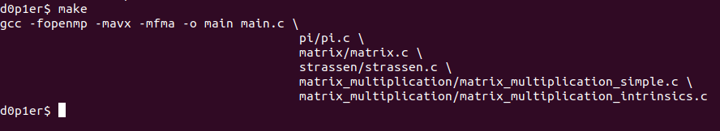
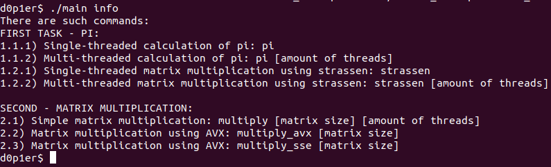
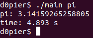
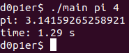
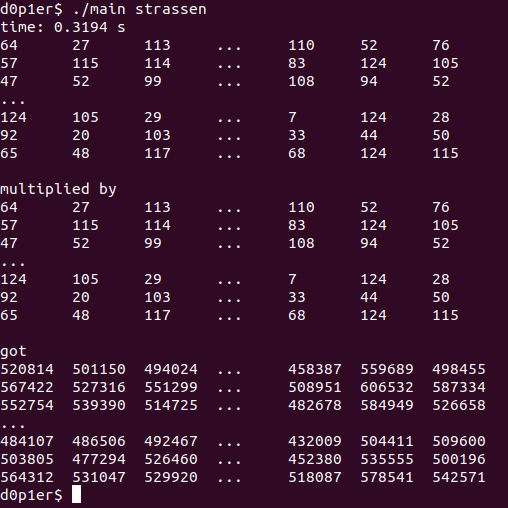
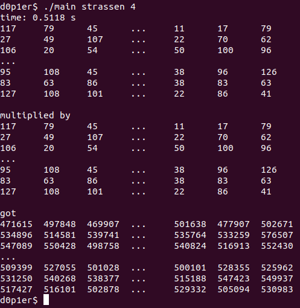
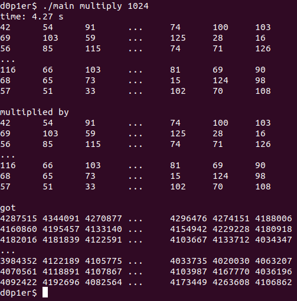
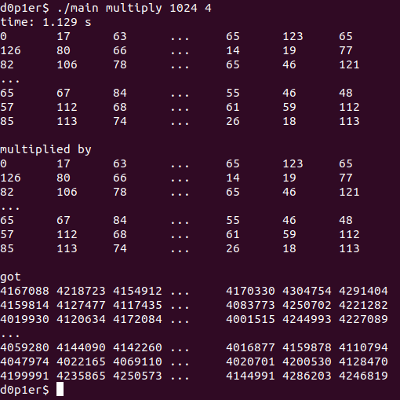
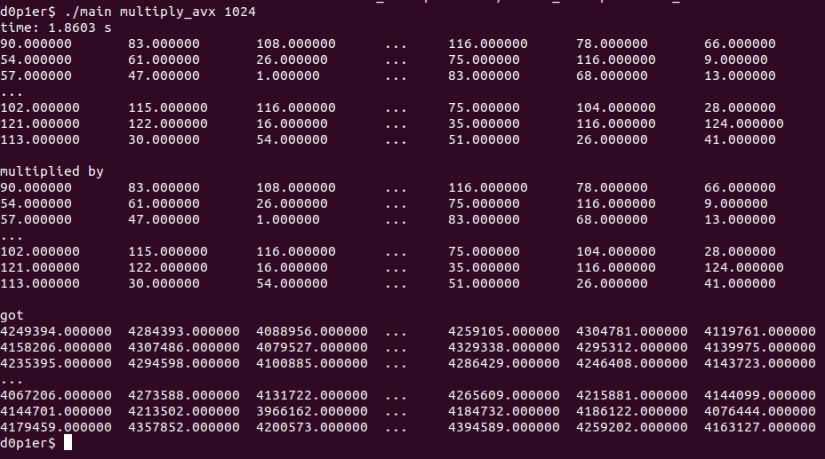
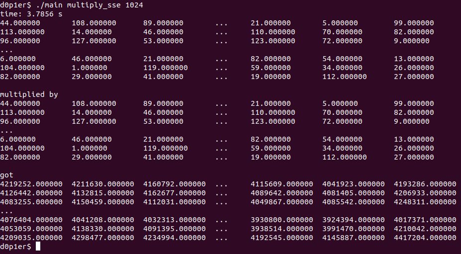

# OPENMP
> sorry for my English

# Content
0. [Compile](#compile)
1. [INFO](#info)
2. [PI](#pi)
3. [Strassen algorithm](#strassen)
4. [Matrix multiplication](#matrix)

<a name="compile"></a>
## 0. Compile
In root directory:
```console
make
```
### Output:




<a name="pi"></a>
## 1. INFO
### See info about commands:
```console
./main info
```

### Output:




<a name="pi"></a>
## 2. PI
There are simple realization and OpenMP implementation
### PI simple:
```console
./main pi
```

### Output:



### PI with OpenMP:

```console
./main pi 4  
```
The second value 4 is amount of threads

### Output:




<a name="strassen"></a>
## 3. Matrix multiplication using Strassen algorithm
There is posibility to enter amount of threads
### Start Strassen algorithm:
```console
./main strassen
```

### Output:



### Start Strassen algorithm with amount of threads:
```console
./main strassen 4
```
The second value 4 is amount of threads

### Output:




<a name="matrix"></a>
## 4. Matrix multiplication AVX, SSE
There are simple multiplication, AVX and SSE optimizations
### Start simple matrix multiplication:
```console
./main multiply 1024
```
The second value 1024 is size of matrix

### Output:



Also there is posibility to enter amount of threads like this:

### Start simple matrix multiplication in parallel:
```console
./main multiply 1024 4
```
The second value 1024 is size of matrix. \
The third value 4 is amount of threads.

### Output:




### Start simple matrix multiplication with AVX optimization:
```console
./main multiply_avx 1024
```
The second value 1024 is size of matrix

### Output:



### Start simple matrix multiplication with SSE optimization:
```console
./main multiply_sse 1024
```
The second value 1024 is size of matrix

### Output:


